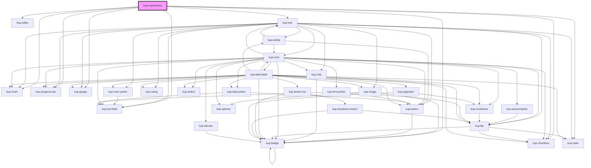

# kup-hypermenu

<!-- Auto Generated Below -->

## Properties

| Property            | Attribute             | Description                                                                                                     | Type                                       | Default     |
| ------------------- | --------------------- | --------------------------------------------------------------------------------------------------------------- | ------------------------------------------ | ----------- |
| `customStyle`       | `custom-style`        | Custom style of the component. For more information: https://ketchup.smeup.com/ketchup-showcase/#/customization | `string`                                   | `''`        |
| `data`              | --                    | Data                                                                                                            | `{ columns?: Column[]; rows?: BoxRow[]; }` | `undefined` |
| `globalFilter`      | `global-filter`       | When set to true it activates the global filter.                                                                | `boolean`                                  | `false`     |
| `globalFilterValue` | `global-filter-value` | The value of the global filter.                                                                                 | `string`                                   | `''`        |

## Events

| Event                     | Description | Type                           |
| ------------------------- | ----------- | ------------------------------ |
| `kup-hypermenu-didload`   |             | `CustomEvent<KupEventPayload>` |
| `kup-hypermenu-didunload` |             | `CustomEvent<KupEventPayload>` |

## Methods

### `getProps(descriptions?: boolean) => Promise<GenericObject>`

Used to retrieve component's props values.

#### Returns

Type: `Promise<GenericObject>`

### `refresh() => Promise<void>`

This method is used to trigger a new render of the component.

#### Returns

Type: `Promise<void>`

### `setProps(props: GenericObject) => Promise<void>`

Sets the props to the component.

#### Returns

Type: `Promise<void>`

## Dependencies

### Depends on

- [kup-badge](../kup-badge)
- [kup-chart](../kup-chart)
- [kup-checkbox](../kup-checkbox)
- [kup-editor](../kup-editor)
- [kup-text-field](../kup-text-field)
- [kup-progress-bar](../kup-progress-bar)
- [kup-radio](../kup-radio)
- [kup-gauge](../kup-gauge)
- [kup-tree](../kup-tree)

### Graph

----------------------------------------------

*Built with [StencilJS](https://stenciljs.com/)*
